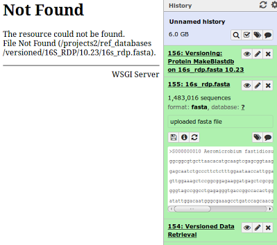

# Caching System

The Versioned Data tool caching system operates in two stages, one covering server folders that contain data store version retrievals, and the second covering Galaxy's "Versioned Data" data library folder behaviour.  The Versioned Data library folder files mainly link to the server folders having the respective content.  As well it has a "Workflow Cache" folder which stores all derivative (output) workflow datasets as requested by users via the Versioned Data tool.

---

### Galaxy behaviour when user history references to missing cached data occur

If a server data store version folder is deleted, the galaxy data library and user history references to it will be broken.  The user will experience a "Not Found" display in their workspace when clicking on a linked datastore like that in their history.  The user can simply rerun the "Versioned Data Retrieval" tool to restore the data.

In the example to the right, clicking on the view (eye) icon for "155:16s_rdp.fasta" triggered this message.  To remedy the situation, the user simply reruns the "154: Versioned Data Retrieval" step below to regenerate the dataset(s).
