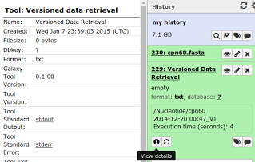
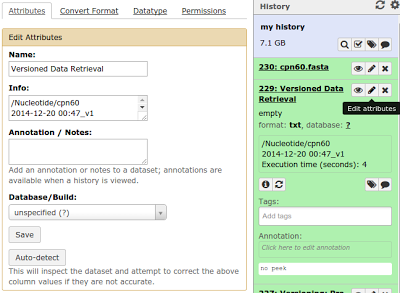

## Data Provenance and Reproducibility

When a user selects particular version id or date for versioned data retrieval, this is recorded for future reference, and can be seen in a history item's "View details" (info icon) report, in the "Input Parameters" section.  But if a user left the global date field blank or didn't select a particular version of a data source, they or another user can still rerun a Versioned Data retrieval to recreate the results by noting the original history item's view details "Created" date and entering it into the global retrieval date of the form.  

