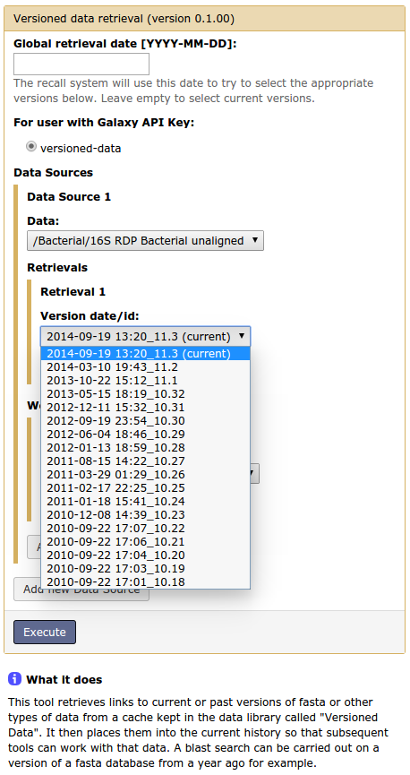

# The Galaxy Versioned Data Tool

This tool retrieves links to current or past versions of fasta or other types of data from a cache kept in the Galaxy data library called "Versioned Data". It then places them into the current history so that subsequent tools can work with that data. A blast search can be carried out on a version of a fasta database from a year ago for example.

You can select one or more files by version date or id. (This list is supplied from the Shared Data > Data Libraries > Versioned Data folder that has been set up by a Galaxy administrator).

In the versioned data tool, user selects a data source, and then selects a version to retrieve (by date or version id).
If a cached version of that database exists, it is linked into user's history.
Otherwise a new version of it is created, placed in cache, and linked into history.
The Versioned Data form starts with an optional top-level "Global retrieval date" which is applied to all selected databases. This can be overridden by a retrieval date or version that you supply for a particular database.

Finally, if you just select a data source to retrieve, but no global retrieval date or particular versions, the most recent version of the selected data source will be retrieved.

The caching system caches both the versioned data and workflow data that the tool generates. If you request versioned data or derivative data that isn't cached, then (depending on the size of the archive) it may take time to regenerate.

## Generation of workflow data

The Workflows section allows you to select one or more pre-defined workflows to execute on the versioned data.  Currently this includes any workflow that begins with the phrase "Versioned: ".  The results are placed in your history for use by other tools or workflows. 

Currently workflow parameters must be entirely specified ("canned"), when the workflow is created/updated, rather than being specified at runtime.  This means that a separate workflow with fixed settings must be predefined for each desired retrieval process (e.g. a blastdb with regions of low complexity filtered out, which requires a few steps to execute  -dustmasker + makeblastdb etc). 

Any user that needs more specific parameters for a reference database creation can just invoke the tools/steps after using the Versioned Data tool to retrieve the raw fasta data.  The only drawback in this case is that the derivative data can't be cached - it has to be redone each time the tool is run.
